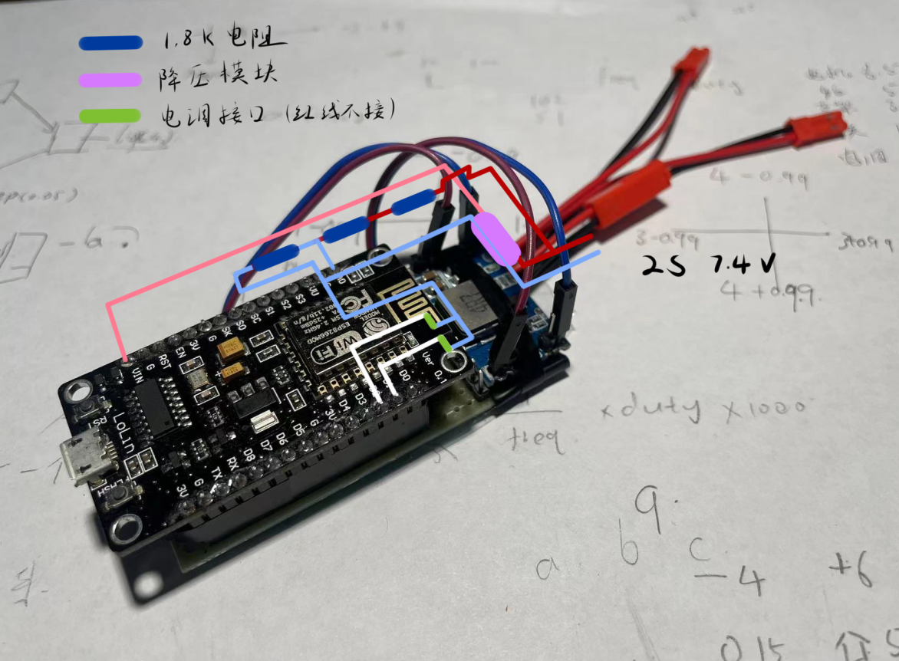

## 游戏手柄控制的ESP8266遥控车(遥控器+接收机)

### 进度
+ 2023.1.2未完全完成。软件部分基本完成，等快递中，可能还要买几个三极管。
+ 2023.1.5设计了5个电调/舵机接口，更新代码。
+ 2023.1.9可以运行。电调和电机到了，电路焊好了，测试后修改一部分代码。

### 简介
+ 用游戏手柄做遥控器（测试了switch pro手柄）
+ 借助电脑wifi连接
+ esp8266做接收机
+ 目前计划是驱动双向电调+双电机差速（~~等有钱了就买一个有舵机的遥控车改一改~~，已买）
+ 监控电池电压，低电压报警
+ 板子是NodeMcu，A0测电压<=3.3V，电调信号推荐用D1、2、5、6、7。

（接12v注意A0电压，需要加个电阻。）
### 使用方法
>1.准备
>>1.1 打开```./sep8266/main.py```  
>>1.2 找到
>>```python
>>addressList=['192.168.10.24','192.168.10.112']
>>```  
>>修改地址为作为遥控端的电脑，可以放多个。  
>>1.3 刷MicroPython的bin，再把sep8266文件夹里的文件烧进去。(*推荐用uPyCraft，可以自动下载固件，操作也很方便。*)  
>>1.4 安装一个好用的库叫pygame，可以读取手柄的数据还可以开发小游戏的图形界面。大赞！
>>```
>>pip install pygame
>>```
>2.开始
>>2.1 先运行serverWithControler.py。如果手柄也连上了，电脑会作为server等待8266响应。  
>>2.2 按一下RST，会开始闪LED（如果没闪说明板子不一样，可能要改一下```./sep8266/main.py```里Pin的值才能用。）  
>>2.3 连上会一直print信息，摇手柄摇杆电机应该会开始转了（如果电调要解锁，需要手动推杆）。

>3.油门微调  
>需要同时按两个键,测试用的是任天堂SWITCH Pro Controler，它的X、Y、A、B按键是和xbox、ps手柄的位置不一样的。用到这些按键可能和我设计的是反着的。
>>*（收到电调后测试发现：每个电调是不一样的，只识别高电平时间。我买到的两个识别到的时间分别是0.98ms至2.25ms中间值是1.62ms， 1.02ms至2.20ms中间值是1.49ms。所以推荐手动修改```config.txt```，想改变旋转方向，只要调换一下mi和ma的值。*  
>>3.1 双向电调油门中位调整  
>>电机1：***按住***手柄十字左，再按X或B键  
>>电机2：***按住***手柄十字右，再按X或B键  
>>3.2 油门范围缩放（比如油门范围-100%到+100%，调整到-75%到+75%）   
>>电机1：***按住***手柄十字左，再按Y或A键  
>>电机2：***按住***手柄十字右，再按Y或A键 

### 其他
+ 有过滤手柄漂移、过滤摇杆归位后的回弹产生数据的代码。是否会造成不灵敏需要再测试一下。
+ 一个理念是放在esp8266的代码最小化。第一次：client发送```51```，server会回复```[51,{'pin':5,'freq':50},{'pin':4,'freq':50},{},{},{}]```决定启用哪几个pin以及它们的频率。之后client会发送目前状态```{'duty1': 76, 'duty0': 76, 'adc': 0, 'sle': 0.1}```。遥控器微调、算占空比等都在电脑上完成，汇总成```{'freq': None, 'duty0': None, 'duty1': None, 'sle': None, 'mes': None}```发回client,8266会不加甄别直接应用。如过要改程序，只需要改电脑上的server。
+ 另一个想法是尽量减少它处理的数据量。如果发送的数据没有变化，它就不会被发到8266上。
+ Micro Python太好用啦，我吹爆。
+ 写了一个休眠的机制，不操作时轮询率是10Hz，动摇杆后升为100Hz(*测试时设成1000Hz也没有问题*)，如果长时间不动会降为0.2Hz，超过一定时间会自动断开连接并关掉PWM。